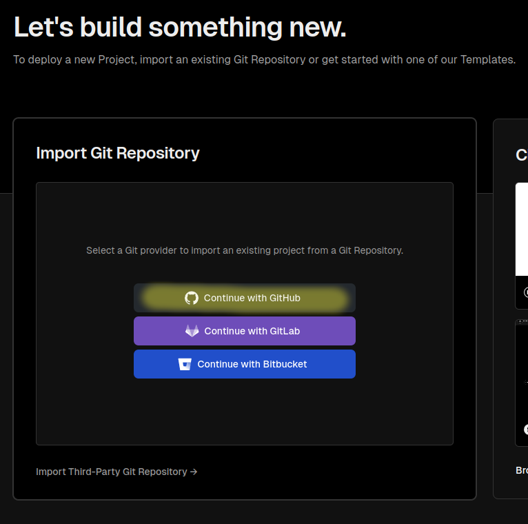

# 06a. Deploying With Vercel

## Starting Point

1. Create a Remix app that syncs a git repository with GitHub.

## Process

### In a web browser

1. Navigate to [https://vercel.com/new](https://vercel.com/new). If you have already signed up for Vercel, linked your GitHub account, and allowed access to a list of repositories, then skip steps 2 & 3.

2. Click the "Continue with GitHub" button and confirm to GitHub that you want to link your account to Vercel.

3. Click the "Install" button to allow Vercel access to a list of some or all of your GitHub repositories.

4. Click the "Import" button for the repository associated with the Remix app you want to deploy.

5. Review the project configuration information and make any adjusments you want before initial deployment. Vercel should automatically recognize your repo as a Remix app, and that will be shown as the "Framework Preset". If you have environment variables for secrets that are not included in the repo, you can add them now by expanding the "> Environment Variables" and enterting the key value pairs. You can also select the entire contents of your envars file, like `.env`, and Vercel will automatically parse the text into the form fields for you.

6. When you are finished configuring your new deployment, click the "Deploy" button and Vercel will build and deploy your app.

7. When it is finished you should see a success message. Click the "Continue to Dashboard" button.

8. Use the URL under "Domains" to see and test your deployed app.

## Notes

- As of Remix v2, the official Remix Docs state that Vercel compatibility works "out of the box" and requires no special configuration or extra imports, however Vercel recommends using some of their custom Remix packages in place of or in addition to what Remix v2 uses out of the box. This author has not tested the differences in functionality when using the Vercel recommended techniques, but keep in mind that these may solve issues not addressed in this guide and the **Vercel Docs References** link below points to Vercel's recommended techniques for deploying Remix apps on their platform.

## Expected Behavior

- Vercel will automatically rebuild the app whenever you sync new changes to the associated GitHub repository. If your changes do not appear to be applied, visit the dashboard page for your app and check the "Status" information. If it is not "\[green dot] Ready", check the Build Logs for more information (see: step 8 image).

## Remix Docs References

[Upgrading to v2: Vercel adapter](https://remix.run/docs/en/main/start/v2#vercel-adapter)

## Vercel Docs References

[Frameworks: Remix](https://vercel.com/docs/frameworks/remix#remix-on-vercel)
